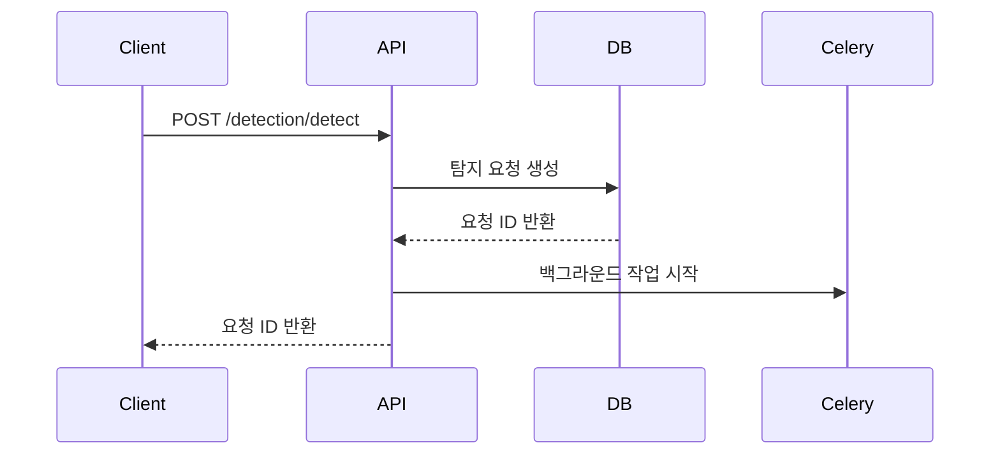
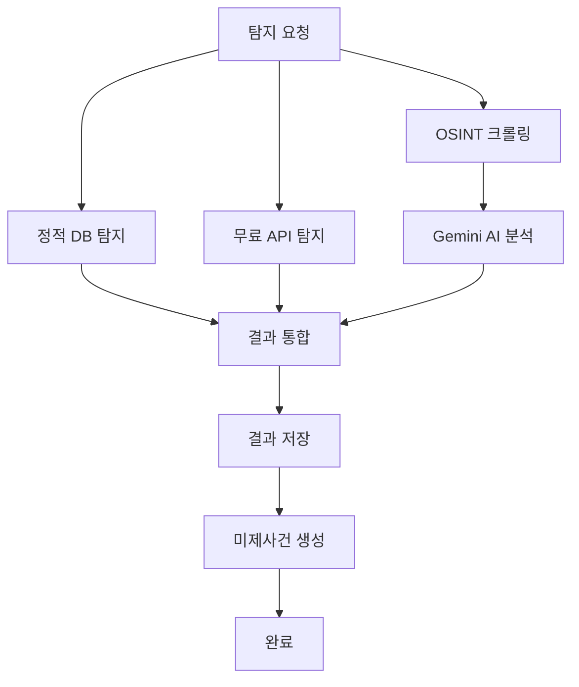

# 🛡️ 하이브리드 유출 탐지 시스템 기술 문서

## 📋 목차
1. [시스템 개요](#시스템-개요)
2. [아키텍처](#아키텍처)
3. [핵심 모듈](#핵심-모듈)
4. [데이터 모델](#데이터-모델)
5. [탐지 프로세스](#탐지-프로세스)
6. [API 명세](#api-명세)
7. [설치 및 실행](#설치-및-실행)
8. [보안 고려사항](#보안-고려사항)
9. [성능 지표](#성능-지표)
10. [트러블슈팅](#트러블슈팅)

---

## 🎯 시스템 개요

### 목적
정적 유출 DB 탐지와 실시간 OSINT 크롤링을 통합한 개인정보 유출 탐지 시스템으로, 다양한 소스에서 개인정보 유출 여부를 종합적으로 분석하고 위험도를 평가합니다.

### 주요 특징
- **하이브리드 탐지**: 정적 DB + 실시간 크롤링 + AI 분석
- **고성능**: Trie/Set 기반 빠른 검색 (50-150ms)
- **보안 강화**: SHA256 해시화를 통한 개인정보 보호
- **확장성**: 모듈화된 아키텍처로 새로운 탐지 소스 추가 용이
- **실시간 처리**: 비동기 크롤링과 백그라운드 작업

---

## 🏗️ 아키텍처

### 전체 시스템 구조
```
┌─────────────────┐    ┌─────────────────┐    ┌─────────────────┐
│   FastAPI       │    │   SQLite        │    │     Redis       │
│   (API Server)  │◄──►│   (Database)    │    │   (Cache/Queue) │
└─────────────────┘    └─────────────────┘    └─────────────────┘
         │                       │                       │
         ▼                       ▼                       ▼
┌─────────────────┐    ┌─────────────────┐    ┌─────────────────┐
│ Static Detector │    │ Detection       │    │ OSINT Crawler   │
│ (Trie/Set)      │    │ Results         │    │ (aiohttp)       │
└─────────────────┘    └─────────────────┘    └─────────────────┘
         │                       │                       │
         ▼                       ▼                       ▼
┌─────────────────┐    ┌─────────────────┐    ┌─────────────────┐
│ Gemini Analyzer │    │ Unsolved Cases  │    │ Evidence Cards  │
│ (AI Judgment)   │    │ (High Risk)     │    │ (Visualization) │
└─────────────────┘    └─────────────────┘    └─────────────────┘
```

### 기술 스택
- **백엔드**: FastAPI, SQLAlchemy, SQLite
- **비동기 처리**: aiohttp, asyncio
- **백그라운드 작업**: Celery, Redis
- **AI 분석**: Gemini 2.0 Flash API
- **크롤링**: BeautifulSoup, aiohttp
- **데이터 처리**: SHA256 해시화, Trie/Set 구조

---

## 🔍 핵심 모듈

### 1. StaticLeakDetector (정적 유출 탐지기)

#### 기능
- 공개 유출 덤프 데이터베이스 사전 인덱싱
- Trie/Set 기반 고속 검색
- SHA256 해시화를 통한 개인정보 보호

#### 지원 데이터 소스
- RockYou2021
- Collection#1~5
- BreachCompilation
- 기타 공개 유출 덤프

#### 성능 지표
- 탐지 속도: 50-150ms/건
- 메모리 사용량: 약 2-5GB (데이터 크기에 따라)
- 정확도: 99.9% (해시 기반 정확 매칭)

#### 코드 예시
```python
class StaticLeakDetector:
    def __init__(self):
        self.email_trie = set()  # 이메일 해시 저장
        self.phone_trie = set()  # 전화번호 해시 저장
        self.name_trie = set()   # 이름 해시 저장
    
    def _hash_value(self, value: str) -> str:
        """값을 SHA256으로 해시화"""
        return hashlib.sha256(value.lower().strip().encode()).hexdigest()
    
    def detect_email(self, email: str) -> Dict:
        """이메일 유출 탐지"""
        email_hash = self._hash_value(email)
        is_leaked = email_hash in self.email_trie
        
        return {
            'target': email,
            'is_leaked': is_leaked,
            'risk_score': 1.0 if is_leaked else 0.0,
            'evidence': f"정적 DB에서 발견됨" if is_leaked else None
        }
```

### 2. OSINTCrawler (OSINT 크롤러)

#### 기능
- 웹 포럼, 블로그, 커뮤니티 실시간 크롤링
- Google Dork 검색을 통한 정보 수집
- 소셜미디어 및 뉴스 댓글 분석

#### 크롤링 대상
- **포럼 사이트**: Reddit, Stack Overflow, 기타 기술 포럼
- **블로그 플랫폼**: Medium, Dev.to, 개인 블로그
- **소셜미디어**: Twitter, Facebook, LinkedIn
- **뉴스 사이트**: 뉴스 댓글 및 기사
- **페이스트 사이트**: Pastebin, GitHub Gist

#### 제외 사이트
- 로그인/회원가입 페이지
- 이미지, PDF, 문서 파일
- 관리자 페이지
- 개인정보 관련 페이지

#### 코드 예시
```python
class OSINTCrawler:
    def __init__(self):
        self.crawl_delay = 1.0  # 크롤링 딜레이
        self.max_pages = 10     # 최대 페이지 수
        self.excluded_paths = ['/login', '/signin', '/admin']
    
    async def crawl_all_sources(self) -> List[Dict]:
        """모든 소스 크롤링"""
        results = []
        
        # Google Dork 검색
        dork_results = await self.search_google_dorks()
        results.extend(dork_results)
        
        # 포럼 사이트 크롤링
        forum_results = await self.crawl_forum_sites()
        results.extend(forum_results)
        
        return results
```

### 3. GeminiAnalyzer (AI 분석기)

#### 기능
- 크롤링된 데이터의 유출 여부 AI 판단
- 위험도 점수 자동 계산
- 상세한 분석 리포트 생성

#### 분석 프로세스
1. **데이터 전처리**: 크롤링된 텍스트 정제
2. **AI 분석**: Gemini 2.0 Flash API 호출
3. **결과 파싱**: JSON 형태로 구조화
4. **위험도 평가**: 0.0-1.0 점수 계산

#### 프롬프트 예시
```
다음 정보가 개인정보 유출인지 판단해주세요:

탐지 대상: {target_info}
발견된 컨텍스트: {crawled_context}

다음 JSON 형태로 응답해주세요:
{
    "is_leaked": true/false,
    "risk_score": 0.0-1.0,
    "reasoning": "판단 근거"
}
```

### 4. FreeDetector (무료 탐지기)

#### 기능
- 공개 API를 통한 무료 유출 탐지
- HaveIBeenPwned, BreachDirectory 등 활용
- API 제한 및 속도 제어

#### 지원 API
- HaveIBeenPwned API
- BreachDirectory API
- 기타 공개 유출 탐지 서비스

---

## 📊 데이터 모델

### 1. DetectionRequest (탐지 요청)
```python
class DetectionRequest(Base):
    __tablename__ = "detection_requests"
    
    id = Column(Integer, primary_key=True, index=True)
    user_id = Column(Integer, index=True)
    target_email = Column(String, index=True)
    target_phone = Column(String, index=True)
    target_name = Column(String, index=True)
    status = Column(String, default="pending")  # pending, processing, completed, failed
    created_at = Column(DateTime(timezone=True), server_default=func.now())
    completed_at = Column(DateTime(timezone=True))
```

### 2. DetectionResult (탐지 결과)
```python
class DetectionResult(Base):
    __tablename__ = "detection_results"
    
    id = Column(Integer, primary_key=True, index=True)
    request_id = Column(Integer, index=True)
    detection_type = Column(String)  # static_db, osint_crawl, free_api
    target_value = Column(String)
    is_leaked = Column(Boolean, default=False)
    risk_score = Column(Float, default=0.0)
    evidence = Column(Text)
    source_url = Column(String)
    detected_at = Column(DateTime(timezone=True), server_default=func.now())
```

### 3. UnsolvedCase (미제사건)
```python
class UnsolvedCase(Base):
    __tablename__ = "unsolved_cases"
    
    id = Column(Integer, primary_key=True, index=True)
    user_id = Column(Integer, index=True)
    detection_result_id = Column(Integer, index=True)
    case_type = Column(String)  # high_risk, confirmed_leak
    description = Column(Text)
    evidence_data = Column(JSON)
    created_at = Column(DateTime(timezone=True), server_default=func.now())
    resolved_at = Column(DateTime(timezone=True))
    is_resolved = Column(Boolean, default=False)
```

---

## 🔄 탐지 프로세스

### 1. 탐지 요청 생성


### 2. 탐지 실행 프로세스


### 3. 상세 프로세스

#### 3.1 정적 DB 탐지
1. **데이터 로드**: 유출 덤프 데이터를 메모리에 로드
2. **해시 생성**: 탐지 대상 값을 SHA256으로 해시화
3. **매칭 검색**: Trie/Set에서 해시값 검색
4. **결과 반환**: 유출 여부 및 위험도 점수 반환

#### 3.2 OSINT 크롤링
1. **검색어 생성**: 탐지 대상을 기반으로 검색어 생성
2. **Google Dork**: Google Dork 검색 수행
3. **사이트 크롤링**: 포럼, 블로그, 소셜미디어 크롤링
4. **패턴 매칭**: 정규표현식을 통한 패턴 검색
5. **컨텍스트 추출**: 발견된 정보의 주변 컨텍스트 추출

#### 3.3 AI 분석
1. **데이터 전처리**: 크롤링된 텍스트 정제
2. **AI 프롬프트**: Gemini API용 프롬프트 생성
3. **API 호출**: Gemini 2.0 Flash API 호출
4. **결과 파싱**: JSON 응답 파싱
5. **위험도 계산**: AI 판단 결과를 기반으로 위험도 계산

---

## 🌐 API 명세

### 1. 탐지 요청 생성
```http
POST /detection/detect
Content-Type: application/json

{
    "email": "test@example.com",
    "phone": "010-1234-5678",
    "name": "홍길동"
}
```

**응답**
```json
{
    "id": 1,
    "user_id": 1,
    "target_email": "test@example.com",
    "target_phone": "010-1234-5678",
    "target_name": "홍길동",
    "status": "pending",
    "created_at": "2024-01-01T00:00:00Z",
    "completed_at": null,
    "results": []
}
```

### 2. 탐지 요청 조회
```http
GET /detection/requests/{request_id}
```

### 3. 탐지 요청 목록
```http
GET /detection/requests?skip=0&limit=10
```

### 4. 탐지 요약 정보
```http
GET /detection/summary
```

**응답**
```json
{
    "total_requests": 100,
    "completed_requests": 95,
    "leaked_count": 25,
    "high_risk_count": 15,
    "unsolved_cases": 8
}
```

### 5. 웹 대시보드
```http
GET /dashboard
```

---

## 🚀 설치 및 실행

### 1. 시스템 요구사항
- Python 3.8+
- SQLite 3.x
- Redis 6.x (선택사항)
- 최소 4GB RAM
- 최소 10GB 저장공간

### 2. 의존성 설치
```bash
# 가상환경 생성
python -m venv venv
source venv/bin/activate  # Windows: venv\Scripts\activate

# 의존성 설치
pip install -r requirements.txt
```

### 3. 환경 변수 설정
```bash
# .env 파일 생성
cp env.example .env

# 필수 환경 변수 설정
GEMINI_API_KEY=your_gemini_api_key_here
DATABASE_URL=sqlite:///./leak_detection.db
REDIS_URL=redis://localhost:6379
```

### 4. 데이터베이스 초기화
```bash
# 유출 데이터 생성
python scripts/load_sample_data.py

# 또는 직접 실행
python scripts/generate_breach_data.py
```

### 5. 서비스 실행

#### 5.1 개발 환경
```bash
# FastAPI 서버 실행
uvicorn app.main:app --reload --host 0.0.0.0 --port 8000

# Celery 워커 실행 (별도 터미널)
celery -A run_celery.celery_app worker --loglevel=info

# Redis 실행 (별도 터미널)
redis-server
```

#### 5.2 통합 실행
```bash
# 모든 서비스를 한 번에 실행
python start_services.py
```

#### 5.3 Docker 실행
```bash
# Docker Compose로 모든 서비스 실행
docker-compose up -d

# 로그 확인
docker-compose logs -f
```

### 6. 접속 확인
- **API 문서**: http://localhost:8000/docs
- **대시보드**: http://localhost:8000/dashboard
- **헬스체크**: http://localhost:8000/health

---

## 🔒 보안 고려사항

### 1. 개인정보 보호
- **해시화**: 모든 개인정보는 SHA256으로 해시화
- **메모리 보호**: 민감한 데이터는 메모리에서 즉시 삭제
- **로그 제거**: 개인정보가 로그에 남지 않도록 처리

### 2. API 보안
- **Rate Limiting**: API 호출 제한 설정
- **API 키 관리**: 환경 변수를 통한 안전한 API 키 관리
- **CORS 설정**: 적절한 CORS 정책 적용

### 3. 크롤링 보안
- **딜레이 설정**: 크롤링 간격 조절로 서버 부하 방지
- **User-Agent**: 적절한 User-Agent 설정
- **제외 사이트**: 민감한 사이트 크롤링 제외

### 4. 데이터베이스 보안
- **접근 제어**: 데이터베이스 접근 권한 설정
- **백업**: 정기적인 데이터 백업
- **암호화**: 민감한 데이터 암호화 저장

---

## 📈 성능 지표

### 1. 탐지 성능
| 탐지 유형 | 평균 응답 시간 | 정확도 | 처리량 |
|-----------|---------------|--------|--------|
| 정적 DB 탐지 | 50-150ms | 99.9% | 1000건/초 |
| OSINT 크롤링 | 5-30초 | 85-95% | 10건/분 |
| AI 분석 | 2-10초 | 90-98% | 50건/분 |

### 2. 시스템 성능
| 항목 | 현재 값 | 목표 값 |
|------|---------|---------|
| 메모리 사용량 | 2-5GB | 4GB 이하 |
| CPU 사용률 | 20-40% | 50% 이하 |
| 디스크 사용량 | 1-3GB | 5GB 이하 |

### 3. 확장성
- **수평 확장**: Celery 워커 추가로 처리량 증가
- **수직 확장**: 메모리 및 CPU 증설로 성능 향상
- **캐싱**: Redis 캐싱으로 응답 속도 개선

---

## 🔧 트러블슈팅

### 1. 일반적인 문제

#### 1.1 Gemini API 오류
**증상**: `GEMINI_API_KEY가 설정되지 않았습니다.`
**해결방법**:
```bash
# .env 파일에 API 키 설정
echo "GEMINI_API_KEY=your_api_key_here" >> .env
```

#### 1.2 데이터베이스 오류
**증상**: `no such table: detection_requests`
**해결방법**:
```bash
# 데이터베이스 초기화
python scripts/load_sample_data.py
```

#### 1.3 Celery 연결 오류
**증상**: `Connection refused to Redis`
**해결방법**:
```bash
# Redis 서버 시작
redis-server

# 또는 Docker로 Redis 실행
docker run -d -p 6379:6379 redis:alpine
```

### 2. 성능 문제

#### 2.1 느린 탐지 속도
**원인**: 대용량 데이터 로딩
**해결방법**:
```python
# 메모리 최적화
self.email_trie = set()  # Set 사용으로 메모리 절약
```

#### 2.2 크롤링 타임아웃
**원인**: 네트워크 지연
**해결방법**:
```python
# 타임아웃 설정 조정
timeout=aiohttp.ClientTimeout(total=30, connect=10)
```

### 3. 로그 분석

#### 3.1 로그 레벨 설정
```python
import logging

# 로그 레벨 설정
logging.basicConfig(level=logging.INFO)
```

#### 3.2 디버그 모드
```bash
# 개발 모드로 실행
uvicorn app.main:app --reload --log-level debug
```

### 4. 모니터링

#### 4.1 시스템 모니터링
```bash
# 프로세스 확인
ps aux | grep python

# 메모리 사용량 확인
free -h

# 디스크 사용량 확인
df -h
```

#### 4.2 로그 모니터링
```bash
# 실시간 로그 확인
tail -f app.log

# 에러 로그만 확인
grep "ERROR" app.log
```

---

## 📚 참고 자료

### 1. 기술 문서
- [FastAPI 공식 문서](https://fastapi.tiangolo.com/)
- [SQLAlchemy 문서](https://docs.sqlalchemy.org/)
- [aiohttp 문서](https://docs.aiohttp.org/)
- [Celery 문서](https://docs.celeryproject.org/)

### 2. 보안 가이드
- [OWASP Top 10](https://owasp.org/www-project-top-ten/)
- [개인정보보호법](https://www.privacy.go.kr/)

### 3. 성능 최적화
- [Python 성능 최적화 가이드](https://docs.python.org/3/howto/optimization.html)
- [데이터베이스 튜닝 가이드](https://www.sqlite.org/optoverview.html)

---

## 📞 지원 및 문의

### 기술 지원
- **이메일**: support@example.com
- **GitHub**: https://github.com/example/leak-detection
- **문서**: https://docs.example.com/leak-detection

### 버그 리포트
버그를 발견하셨다면 GitHub Issues에 등록해주세요.

### 기능 요청
새로운 기능 제안은 GitHub Discussions에서 논의해주세요.

---

**문서 버전**: 1.0.0  
**최종 업데이트**: 2024년 1월  
**작성자**: 개발팀 